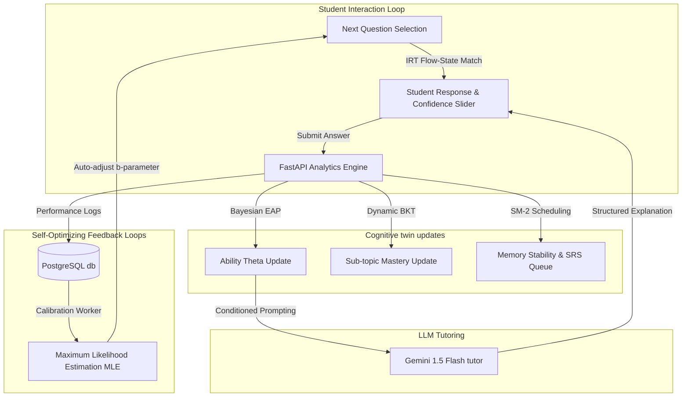

# Officers Arena: Metacognitive-Aware Adaptive Intelligence Engine

An enterprise-grade, high-fidelity adaptive learning platform designed for high-stakes competitive examinations (UPSC/CDS). By combining **Item Response Theory (IRT)**, **Bayesian Knowledge Tracing (BKT)**, **Spaced Repetition System (SRS)** scheduling, and **Generative AI**, the platform dynamically models student proficiency (Cognitive Digital Twin) and self-optimizes question banks.

---

## 1. Core Mathematical Implementations

### **A. Item Response Theory (IRT): 3-Parameter Logistic Model**
The selection and assessment engine utilizes a 3PL IRT model to estimate student ability ($\theta$) and question parameters.

* **Probability Function**:
  $$P(\theta) = c + \frac{1 - c}{1 + e^{-a(\theta - b)}}$$
  Where:
  * $\theta \in [-4.0, +4.0]$ represents the student's latent ability.
  * $a$ represents the question's discrimination factor.
  * $b$ represents the question's difficulty index.
  * $c$ represents the guessing pseudo-probability (distractor strength).

* **Ability Estimation (EAP)**:
  Uses an **Expected A Posteriori (EAP)** Bayesian approach to update $\theta$ after each submission. The posterior distribution is calculated across a quadrature grid of $41$ points with a localized normal prior:
  $$f(\theta | X) \propto f(X | \theta) \cdot N(\theta_{current}, 1.0)$$

* **Challenge Optimization (Flow State)**:
  * target window: $P(\theta) \in [0.5, 0.7]$.
  * **Widening Search**: Falls back to $P(\theta) \in [0.4, 0.8]$ if no questions match.
  * **Hard Fallback**: Selects the question whose difficulty $b$ is closest to $\theta$.

---

### **B. Confidence-Weighted Bayesian Knowledge Tracing (BKT)**
Tracks mastery of specific syllabus sub-topics (e.g., *Emergency Provisions*, *River Mapping*) recursively based on student responses, metacognitive confidence rating, and question difficulty.

* **Formula**:
  $$P(L_n) = P(L_{n-1} | Obs) + (1 - P(L_{n-1} | Obs)) \cdot P(T)$$
  Where $Obs$ accounts for:
  * **Lucky Guess**: Correct response with low confidence (gain penalty).
  * **Confidence-Weighted Slip**: Incorrect response with high confidence (mastery penalty).
  * **Difficulty Adjustments**: Harder questions weight correct answers more heavily, while easier questions penalize incorrect answers more severely.

---

### **C. Spaced Repetition System (SRS)**
Models memory decay and recall probability using a modified SM-2 scheduling algorithm.

* **Recall Decay Function**:
  $$P_{recall} = e^{-\ln(2) \cdot \frac{t}{S}}$$
  $$\text{Urgency Score} = 1.0 - P_{recall}$$
  Where $t$ is days elapsed since last review and $S$ is memory stability.
* **Metadata Tracked**:
  * `stability`: Memory retention half-life multiplier.
  * `difficulty`: User-specific question weight.
  * `interval`: Days until the next review session.

---

## 2. Self-Correcting Data Loop (Auto-Calibration)

Initial question parameters ($a, b, c$) set by authors are often misaligned with real-world performance. To resolve this, a background worker script is included to dynamically recalibrate the database parameters:

* **Location**: [scripts/calibrate_questions.py](file:///c:/Users/braha/officers-arena/scripts/calibrate_questions.py)
* **Optimization Method**:
  1. Once a question accumulates a critical mass of responses (e.g., $\ge 100$), the script pulls the binary responses and matching student abilities ($\theta$).
  2. If the observed success rate differs from the predicted success rate by more than $20\%$, the difficulty index ($b$) is adjusted.
  3. The script solves a Maximum Likelihood Estimation (MLE) optimization using a grid-search search-space over binary cross-entropy:
     $$\mathcal{L}(b) = - \sum_{i=1}^{N} \left[ y_i \ln P(\theta_i | a, b, c) + (1 - y_i) \ln(1 - P(\theta_i | a, b, c)) \right]$$
     This guarantees the difficulty parameter converges to the true empirical item metric.

---

## 3. Adaptive AI Tutoring Layer

A dynamic explanation engine integrates generative AI directly into the review phase without blocking test execution flow.

* **Location**: [tutor_service.py](file:///c:/Users/braha/officers-arena/apps/api/app/services/tutor_service.py)
* **LLM Engine**: Powered by Google Gemini 1.5 Flash.
* **Theta-Conditioned Prompting**:
  * **Beginner ($\theta < -1.0$)**: Explains basic terms and core definitions with a supportive tone.
  * **Intermediate ($-1.0 \le \theta \le 1.0$)**: Explains logical linkages, reasoning pathways, and structural correlations.
  * **Advanced ($\theta > 1.0$)**: Skips fundamentals; analyzes distractors, traps, and subtle nuances.
* **Tutor Safety Guardrails**:
  * *"Never give the direct answer immediately. Guide the student to the logic first."*
  * *"If the question involves a Map (MapViewer), refer to specific coordinates or landmarks."*

---

## 4. Research A/B Testing Toggle

To facilitate scientific validation of the adaptive learning algorithms:
* A `is_adaptive` boolean flag is included in the `StudentState` table.
* **Control Group (`is_adaptive = False`)**: The selection engine falls back to randomized question selection, disabling IRT scheduling.
* **Experimental Group (`is_adaptive = True`)**: Receives the fully optimized IRT and BKT flow-state matching.
* Allows researchers to isolate the efficacy of adaptive cognitive scheduling against standard progression models.

---

## 5. Technology Stack & API Endpoints

* **Backend**: FastAPI, SQLModel (SQLAlchemy/PostgreSQL), NumPy, Uvicorn.
* **Frontend**: Next.js 14, Zustand (State Management), Framer Motion (Animations), TailwindCSS.

### **Core API Router**:
* `GET /api/v1/arena/next-question?user_id={id}&exam_type={type}`: Returns the next calibration or flow-state optimized question.
* `POST /api/v1/arena/submit`: Processes student responses and updates IRT, BKT, and SRS parameters.
* `GET /api/v1/arena/explain/{question_id}?user_id={id}`: Fetches the theta-conditioned AI tutoring explanation.
* `GET /api/v1/arena/mastery-map?user_id={id}`: Compiles sub-topic percentages for radar chart visualization.
* `GET /api/v1/arena/session-report?user_id={id}`: Generates progress percentages, mastery level shifts, and simulated score expectations.
* `GET /api/v1/arena/srs/dashboard?user_id={id}`: Fetches the spaced repetition priority queue.
